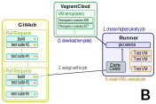

# FreeIPA PR CI Developer Documentation

## Overview


A swarm of independent machines called *runners* is monitoring Pull Requests
(PRs) on GitHub. Runners aren't aware of each other and they can be deployed in
different environments (cloud, beaker, developer's hardware...). They have to
support virtualization. If the runner (host) is a virtual machine itself, it
has to support nested virtualization (`vmx` CPU flag). Runners can be deployed
with an ansible playbook (see
[Setting up runner](../README.md#setting-up-runner)).

Runners are capable of executing a job (build, running a test suite). This job
is chosen from a queue that is periodically constructed by polling
GitHub API for PRs. To execute a job, runners use custom VM templates which are
downloaded from [VagrantCloud](https://app.vagrantup.com/freeipa). Once a job
finishes, logs are uploaded to
[fedorapeople.org](https://fedorapeople.org/groups/freeipa/prci/) where they're
publicly accessible to the community. Finally, the job result along with the logs'
URL are reported to GitHub via a
[commit status](https://developer.github.com/v3/repos/statuses/).

### A. Generating the job queue


Each runner has to keep an up-to-date queue of jobs. Since the runners are
independent and do not rely on any central node, this is achieved by
periodically polling the GitHub API and iterating over all PRs. This approach,
compared to using [webhooks](https://developer.github.com/webhooks/), has known
limitations and drawbacks, discussed in section [Polling GitHub PR
Queue](##polling-github-pr-queue).

#### Commit statuses

To construct the job queue, the runner retrieves each PR and the commit of its
`HEAD`. The commit can have multiple
[commit statuses](https://developer.github.com/v3/repos/statuses/) associated
with it. These are used by the various CIs (e.g. Travis CI) to report results of
various checks and they are well integrated into GitHub web interface.

Commit statuses consist of `state`, `context` and optionally `description` and
`target_url`. *Context* is a unique identifier of the commit status. *State*
can be one of `pending`, `success`, `error` and `failure`.

##### Create new jobs

One of the runner's responsibilities is to generate `pending` commit
statuses for jobs, to signal these jobs have to be executed as part of the
CI testing. The source of the job defitions can be configured. For FreeIPA,
it's set to `.freeipa-pr-ci.yaml` file in the root of the repository. This job
definition file contains the necessary information to execute a job along with
a unique job identifier, which is used for the commit status' context. The job
definition file is retrieved:

* from the PR itself, if it was modified; or
* from the target branch of the PR (usually `master`).

This allows to set up different test suites for different branches. The
retrieval from a target branch is also important to ensure up-to-date job
config is used for testing. It eliminates the need to rebase a PR when the job
definition file changes (e.g. new test is added).

##### Get status of existing jobs

If the PR already has commit statuses for all the jobs, the runner simply
retrieves their last *state*.

##### Constructing a job queue

All *pending* jobs are added to a queue by their priority. The priority is a
tuple containing:

- `True` if PR has *prioritize* label, `False` otherwise,
- job priority from the job definition file,
- number of completed jobs for PR.

#### CacheControl

GitHub imposes a [rate limit](https://developer.github.com/v3/#rate-limiting)
of 5000 API requests per hour. To avoid exceeding this limit, they also offer
[conditional requests](https://developer.github.com/v3/#conditional-requests),
which return data only if they changed and `304 Not Modified` otherwise.
Conditional requests aren't deducted from the API limit. For this reason we use
[CacheControl](https://github.com/ionrock/cachecontrol) which handles the
conditional requests and transparently returns the latest up-to-date data with
`200 OK`.

As a CacheControl backend, we use a persistent cache
[redis](https://redis.io/). This was necessary to avoid hitting the rate limit
when rebooting the runners.

### B. Executing a job



After a prioritized job queue is available, the runner attempt to take the
highest priority job. If it succeeds, it begins setting up the environment for
the job execution. It downloads a VM template from
[VagrantCloud](https://app.vagrantup.com/freeipa) (if it's not already cached)
and creates the necessary VMs. Afterwards, the job is executed.

#### Assigning a job

Since the queue takes some time to create (see [Abuse limit](#abuse-limit) for
details), it may be out of date and the job might have been assigned/executed
already. Before a runner takes a job, it queries the API to verify the job's
commit status is still `pending` and its *description* is `unassigned`. If it's
already taken, the runner skips to the next job.

If the job is still unassigned, the runner will attempt to take it by changing
the commit status' *description* to a string containing the runner's id
(usually short hostname). It also waits for a short period of time and checks
the status again to verify no other runner attempted to take the task as well.
If it did, the string will have changed and the last runner to write the commit
status wins the job. Other runners will simply move on and attempt to take the
next job.

#### Executing a job

In theory, PR CI can be used for arbitraty code execution. In practice, we've
implemented the following basic jobs (see [tasks/tasks.py](../tasks/tasks.py)):

- `Build` builds FreeIPA in a mock environment using the specified VM template
  that was generated with
  [ansible/create_template_box.yml](../ansible/create_template_box.yml)
- `RunPytest` creates a topology and runs a specified py.test suite,
  also using the VM template above; if `xmlrpc` argument is set to `True`, it
  installs freeipa server and sets it up for xmlrpc tests
- `RunPytest2` uses `ipa-run-tests-2`
- `RunPytest3` uses `ipa-run-tests-3`
- `RunWebuiTests` sets up freeipa server to execute webui tests

See section [Template](#template) for details about the template.

#### Re-running tasks

After PR#83, it's possible to re-run only the failed tasks. To do that, the
user just need to add the `RERUN_LABEL` label to the PR. In the next iteration,
the code will check if the PR has tasks in status `error` or `failure`, and if
it has the `RERUN_LABEL` label. If true, the tasks will have their status
changed to `unassigned`.

You can also re-run a PR in order to get new tasks that were added in the
config file to the target branch.

### C. Reporting results


Once the job is finished (or killed), it will upload the logs to
fedorapeople.org using rsync and `freeipa_pr_ci` ssh key. These logs are
publicly accessible and their URL will be generated and reported to the commit
status of the PR's job. The commit status' *state* will change to one of
`success`/`failure`/`error`. If any of the individual jobs for the PR are
unsuccessful, the overall status of the PR (visible in the [PR
list](https://github.com/freeipa/freeipa/pulls)) will be failed. Finally, the
runner moves on to phase A and repeats the entire process.

#### Finishing the job

The job can end in multiple ways:

- **success**: The job finishes successfully and the outcome of the
  build or test suite execution is positive.
- **faliure**: The job finishes successfully, but the outcome of the build or
  test suite execution is negative. This usually signifies an issue with the
  changes proposed in the PR.
- **error**: Sometimes, an infrastructure issue can occur -- such as errors
  during provisioning, downloading packages from fedora infrastructure etc.
  These will report an exception and its message to the commit status'
  *description*. They are also reported to [sentry.io](https://sentry.io),
  where you can find the complete traceback along with the runner's hostname to
  debug the issue.
- **timeout**: This is reported as `error` with `TimeoutException`. Each job
  can have a `timeout` argument in the `.freeipa-pr-ci.yaml` config. If this
  time limit is exceeded, the job is killed, cleaned up and the available logs
  are uploaded. This can signify an issue with both the PR CI infrastructure or
  the changes proposed in the PR.

A proper cleanup (decomissioning VMs, etc) should happen in all cases.

## Job definition file

The jobs which are supposed to be executed for a given PR are defined in
[`.freeipa-pr-ci.yaml`](https://github.com/freeipa/freeipa/blob/master/.freeipa-pr-ci.yaml)
file in the FreeIPA git repository. This file can be different for each branch.
If you want to add a test case or bump the template's version, you should make
sure to update the file in all the appropriate branches.

### File structure

The config is an ordinary YAML file. The individual jobs are defined under the
`jobs` key. The following file has two jobs defined -- `fedora-26/build` and
`fedora-26/simple_replication`. These identifiers have to be unique and will be
used as commit status' *context*.

In the config file is also described what topologies are supported. Each
topology must describe the amount of `cpu` and `memory` needed, using the
structure bellow, defined under the `topologies` key. The topology name must
match the sufix of a Vagrantfile inside the `templates/vagrantfiles` dir.  
As an example, for the `build` topology there is a
`templates/vagrantfiles/Vagrantfile.build` file. You can check the already
defined topologies [here](https://github.com/freeipa/freeipa-pr-ci/tree/master/templates/vagrantfiles).

```yaml
topologies:
  build: &build
    name: build
    cpu: 2
    memory: 3800
  master_1repl: &master_1repl
    name: master_1repl
    cpu: 4
    memory: 5750

jobs:
  fedora-26/build:
    requires: []
    priority: 100
    job:
      class: Build
      args:
        topology: *build
        # <snip/>

  fedora-26/simple_replication:
    requires: [fedora-26/build]
    priority: 50
    job:
      class: RunPytest
      args:
        topology: *master_1repl
        # <snip/>
```

Jobs can have the following arguments:

- `requires`: A list of jobs that are a pre-requisite to execute this job.
  Until all required jobs are in the `success` state, this job won't be
  executed by any runner.
- `priority`: In the cases where multiple jobs are available for execution,
  higher priority jobs will be executed first. This can be useful to make sure
  long-running tests are executed as soon as possible.
- `job`: This is a job definition that determines how the job should be
  executed. It tells the PR CI which class will be used to execute the job
  along with the required arguments It tells the PR CI which `class` will be
  used to execute the job along with the required arguments (`args`). These
  classes are defined in [tasks/tasks.py](../tasks/tasks.py) and can be used to
  customize the PR CI in any way.

Jobs **must** have the following argument:

- `topology`: The name of the topology (defined at the top of config file) will
  be used to run the job. The name must be prefixed by a `*`.  

#### Build

The following snippet defines a `Build` job. This is FreeIPA-specific task
that uses mock environment with the VM template with our FreeIPA COPR to build
FreeIPA packages.

```yaml
      class: Build
      args:
        git_repo: '{git_repo}'
        git_refspec: '{git_refspec}'
        template: &ci-master-f26
          name: freeipa/ci-master-f26
          version: 0.1.3
        timeout: 1800
        topology: *build
```

Some of these arguments are common to all FreeIPA jobs.

- `template`: Specifies which VM template (`name` and `version` will be used).
  Runner will download this tempate from
  [VagrantCloud](https://app.vagrantup.com/freeipa) if it's not already cached.
  The `&ci-master-f26` is a YAML syntax for [anchor
  definition](http://www.yaml.org/spec/1.2/spec.html#id2760395). The parser
  will paste the data structure to later occurences of `*ci-master-f26`.
- `timeout`: Maximum allowed time in seconds. If the job is still running after
  this period of time passes, it will be killed, torn down and reported as an
  error.

There are also `Build` specific arguments.

- `git_repo`: The URL of target git repository to build from. This will usually
  be `https://github.com/freeipa/freeipa`.
- `git_refspec`: The refspec comes in the form of `pull/666/head` and if
  `git_version` is not also specified, the `HEAD` of this refspec is used. This
  practically identifies the special reference that has to be fetched for the
  PR's code to be available.
- `git_version`: This parameter can be used to perform a build from a known
  tag (`release-4-6-1`), commit (sha) or branch (`master`). Some versions may
  not be available in the basic tree and require `git_refspec` (typically code
  that's in unmerged PRs).

#### RunPytest

```yaml
      class: RunPytest
      args:
        build_url: '{fedora-26/build_url}'
        test_suite: test_integration/test_simple_replication.py
        template: *ci-master-f26
        timeout: 3600
```

The `RunPytest` specific arguments include:

- `build_url`: URL where the results of the build job are available. The class
  expects a `rpms/freeipa-prci.repo` file to be avaible and pointing to an
  existing rpm repository with packages to test (also created by the `Build`
  job). 
- `test_suite`: Argument that is passed to py.test. It can be any string that
  can be interpreted by py.test -- you can specify multiple test cases
  separated by a space, or select a specific class/method to be executed.

#### Magic values

There are some magical values used for certain arguments. These are provided by
the PR CI runner and replaced by the Python interpreter before they're passed
to the class.

- `{git_repo}`: URL of the configured target repository the PR is tested against.
- `{git_refspec}`: Refspec containing the PR to be tested.
- `{<job_name>_url}`: Provided the `<job_name>` is a dependency of this job,
  this will contain the resulting url from the specified job's commit status.

## Template

A template with all the dependencies and necessary configuration is
pre-generated and uploaded to VagrantCloud. Each FreeIPA branch may require a
separate template, due to different or conflicting dependencies.

### Dependencies

Build and Runtime dependencies are installed in the template, which saves
significant amount of time and traffic. It also makes the system more robust,
because all the dependencies are known to be working (they aren't automatically
updates on each job execution).

#### PR requires new/updated dependency

In the cases when a package update is needed, a spec file is bumped. If the new
depepdency is available in `fedora` or `updates` repository, you don't need to
do anything. If it isn't, you'll have to provide it in the appropriate @freeipa
COPR repository, which is configured to use with the template.

### Build and Runtime environment

The same template is used both for building FreeIPA and running tests on it.
Mock environment is configured to be used for build. This is made to ensure
that Build and Runtime dependencies don't get mixed up in the spec file.

### Add new Fedora version

To enable template creation with a new Fedora version, add a config file in
[`ansible/vars/fedora/`](../ansible/vars/fedora/). See any existing template for
example.

### Fedora Rawhide template

This template is intended for testing stable code (aka master) that is known to
be working on previous Fedoras. The intent of testing on rawhide is to uncover
issues with dependencies. These tests should be regularly executed and
packages should be updated every time.

Don't forget to update
[`ansible/vars/fedora/rawhide.yml`](../ansible/vars/fedora/rawhide.yml) when
new Fedora is branched (bump `fedora_releasever`).

## Limitations

The system was designed to not be dependent on any single machine. For this
reason, all the runners can act independently and they don't know about
each other. This removes a potential central point of failure (altough some
remain -- GitHub API or fedorapoeple.org storage). This design decisions comes
with some trade-off and limitation described below.

### Polling GitHub PR Queue

There is no central point which could use
[webhooks](https://developer.github.com/webhooks/) to get updates from
GitHub and delegate the work. Each runner has to create the PR job queue by
itself. This approach has known limitations which affect scalability.

#### Number of open PRs

The infrastructure works best with small amount of open PRs. It was designed to
handle tens of open PRs. Additional PRs will slow down the response time of
the entire system and may deplete API request pool quicker.

#### API limit

GitHub imposes a limit of 5000 requests per hour. Since the system implements
persistent caching, this shouldn't be an issue. However, in certain cases,
such as setting up multiple new runners at the same time, where no cache is
available, this limit could be hit.

#### Abuse limit

Even the cached requests (wich return 304) are limited by the GitHub API.
Experimental testing showed 1500 requests per minute to be safe. Since a
queue of 50 PR can take about 250 API requests to scan, this limit can be hit
when multiple runners are polling the queue.

Since the entire system is designed to have parallel testing with multiple
runners, this limit can be hit, even with as little as ten runners. There is
no good way to synchronize the runners or share the queue, so the workaround
is to artifically slow down the rate at which the runners can query the API
(see [PR#65](https://github.com/freeipa/freeipa-pr-ci/pull/65)).

This imposes a limitation on the number of runners and open PRs. Currently,
the system should be scalable up to 25 runners with 50 open PRs. Increasing
the timeout may allow further scaling.

The current timeout of 0.5s adds a significant delay to the processing of the
PR queue, which delays the start of the job (currently, it can take up to 10s
per PR).

If further scaling is needed, some central point would have to be introduced,
which would allow the runners to use the same queue.

### Commit statuses

Each commit can have a maximum of 1000 commit statuses associated with it.
Every single update to a commit status counts towards this limit, not just the
unique contexts.

This should be easily scalable up to at least 50 unique contexts. Increasing
the amount of unique contexts further may cause some issues with multiple
re-runs, which generate additional commit status' updates.

To work around the potential re-run issue, a PR can be rebased (without any
changes, just to generate new commit) and the commit status limit will be
refreshed.

## Workarounds

### 3-hour reboot

0836fde2b73bac4c48731de7c4d0a5b91bbe2e17: runner is periodically rebooted after
3 hours. See commit message for explanation. The behavior causing the issues was
observed in ABC lab with Fedora 25.
