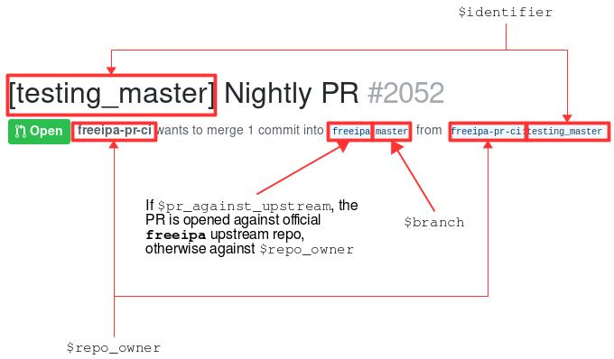

# FreeIPA PR CI Developer Documentation

## PR Scheduler Tool

### Overview

With the PR-CI, a suite of tests is launched when a Pull Request is opened
against freeipa github repository, but this test suite contains only a
selection among all the tests available in `ipatests/` directory (the
full suite would take too long to execute on each PR).

However, the team wants to run the full test suite regularly, in an automated
way. The PR scheduler tool is allowing this scheduling of nightly PRs. It
consists in a python script `open_close_pr.py` which creates a PR in a github
repository, changing the `.freeipa-pr-ci.yaml` file to point to a different
test definition file (e.g. ipatests/prci_definitions/nightly_master.yaml from
freeipa project). The PR-CI runners then detect the PR and launch the test
suite defined in `.freeipa-pr-ci.yaml` file.

In addition, PR-CI uses pre-defined templates for gating/nightly runs. The
templates can rely on different OS versions such as f28, f29, rawhide, and
different repositories such as updates, pki-copr, etc... This is good
because it makes the process more stable by avoiding repeating unnecessary
steps. Based on these templates, the team wants to trigger different nightly
flow runs so the CI can catch bugs from, for instance, newer version of
IPA dependencies.

Hence, PR scheduler tool is also used to automatically upgrade vagrant
templates by sending weekly PRs. The new templates will be later used by the
corresponding nightly flows.

The python script can be regularly launched with a cron job. In order to
easily install the script and configure cron on the scheduler machine,
the Ansible playbook `ansible/prepare_openclose_pr_tool.yml` is also
provided in this repository.

This document describes both aspects of the project:
* the python script responsible for the PR creation
* the ansible playbook responsible for the installation and configuration
of the script on a scheduler machine

### open_close_pr script

This script is automating the creation of a dummy pull request against
the official freeipa upstream repository. It is launched on a machine called
the scheduler. This machine does not need to be very beefy, as it only
creates a pull request (the tests are executed on PR-CI runners when they
detect that a new PR has been created).

The script is basically doing what a regular user would do in order to
create a PR.
Prerequisites:
- a normal user needs to have a github account in order to create PRs.
The github account is stored in the variable $repo_owner
- a normal user needs to have a fork of freeipa github repo, accessible
through https://github.com/$repo_owner/freeipa

In order to create a PR, a user needs to:
- create a local clone of freeipa github repo (= the official freeipa repo)
- checkout a local branch $branch (for instance master)
- push this local branch to his fork
- create a local branch for the commit: $identifier
- create a local commit in the $identifier branch: replace the link
`.freeipa-pr-ci.yaml`, to point to the file containing the test definition,
provided as `$prci_config`
- push the commit to the user's fork
- create the PR against the user's fork branch $branch or against upstream,
depending on the value $pr_against_upstream
- delete the local branch

The script usage for open_nightly_pr command is the following:
```
python3 open_close_pr.py \
    open_nightly_pr
    [--config config.yml]\
    [--id identifier] \
    [--repo_path freeipa_repo_path] \
    [--branch branch] \
    [--flow nightly_flow]\
    [--pr-ci-config test_definitinon.yaml] \
    [--pr_against_upstream True|False] \
```

while the script usage for open_template_pr is the following:
```
python3 open_close_pr.py \
    open_template_pr
    [--config config.yml]\
    [--id identifier] \
    [--repo_path freeipa_repo_path] \
    [--prci_repo_path freeipa-pr-ci_repo_path] \
    [--branch branch] \
    [--flow nightly_flow]\
    [--prci_def_dir ipatests/prci_definition] \
    [--fedora_ver version_number] \
    [--atlas_config atlas_box_uploader.yaml] \
    [--pr_against_upstream True|False] \
```

where atlas_box_uploader.yaml must contain the following configuration:
```
url: https://vagrantcloud.com
username: $vagrant_username
token: $vagrant_token
```

Taking an open_nightly_pr as an example, the arguments can be explained
with the following picture, showing the resulting PR opened by the
script:



* config.yml is a configuration file which must contain the following
information:
```
# cat config.yml
repository:
  owner: $repo_owner
  name: $repo_name
credentials:
  token: $github_token
```


### Ansible playbook

#### Use the playbook

In order to install and configure the scheduler tool on a machine, you can
use the ansible playbook `ansible/prepare_openclose_pr_tool.yml`. You need
first to edit the inventory file `ansible/hosts/runners` and define the
machine that will be used as scheduler (the playbook will apply to all
 the machines in the [scheduler] group):
```
# cat ansible/hosts/runners
[scheduler]
1.2.3.4        # the scheduler IP
```

Then run:
```
ansible-playbook -i ansible/hosts/runners ansible/prepare_openclose_pr_tool.yml
```

The playbook will prompt you for variables:
```
# ansible-playbook -i ansible/hosts/runners ansible/prepare_openclose_pr_tool.yml
Provide an unique identifier for the PR: testing_master    # $identifier
Repo owner to create branches: freeipa-pr-ci               # $repo_owner
GitHub token: 123qwerty                                    # $github_token
Provide the path to a test definition file to use it to open new PRs. For example: ipatests/prci_definition/gating	# $prci_config, for instance ipatests/prci_definition/nightly_master.yaml
Provide a ssh key that has push access to the git repo: ~/path/to/ssh_key #$git_sshkey
Should the PR be open against the upstream repo?. Type no for opening it agaist your own freeipa repo (yes/no): no
Provide PRCI test definitions folder E.g. ipatests/prci_definition # $prci_def_dir
Provide Fedora version (int) for template creation. E.g. 29 # $fedora_ver
Provide Vagrant atlas token for uploading boxes # $vagrant_atlas_token
```

The ansible playbook will schedule multiple PRs that are currently defined in
the project (e.g. automation/nightly_pr/defaults/main.yaml), with unique IDs.
These IDs are used to create the branch and to name the PR.


#### Playbook tasks

The playbook is performing multiple tasks in order to install and configure
the python script:
* installation of python and deps for ansible modules (python2, python2-dnf,
libselinux-python)
* prompting of required variables (identifier, flow, repo_owner,
github_token, prci_config, git_sshkey, pr_against_upstream, prci_def_dir,
fedora_ver, vagrant_atlas_token)
* installation of the role `automation/setup`:
  * installation of required packages: python3-github3py, PyYAML, git, crontabs,
  python2-tqdm, ansible, vagrant, libvirt, vagrant-libvirt, rsync
  * installation of python dependencies: CacheControl, gitpython, ryd
  * creation of the base repository where the tool and config is stored:
`/root/openclose_pr`
  * creation of the configuration file `/root/openclose_pr/config.yaml`
containing repo info and credentials
  * installation of the python script in `/root/openclose_pr/open_close_pr.py`
  * linking of the test definition file
`/root/openclose_pr/.freeipa-pr-ci.yaml` to $prci_config
  * preparation of ssh configuration in order to access github.com
  * creation of a clone repo from $repo_owner/freeipa.git to
`/root/openclose_pr/freeipa/`
  * configuration of the cron job to run every mon, wed, fri at 23:00

#### Current scheduling

The following represents the current schedule mixing both nightly and
template generation PRs:

Monday: master
Tuesday: f28
Wednesday: master
Thrusday: f28, template_rawhide, template_pki
Friday: master
Saturday: rawhide
Sunday: ipa-4-7, pki

The repo_owner is the github user `freeipa-pr-ci`.
